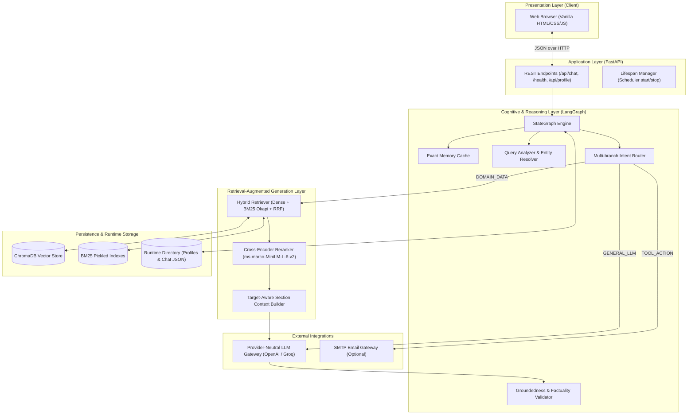
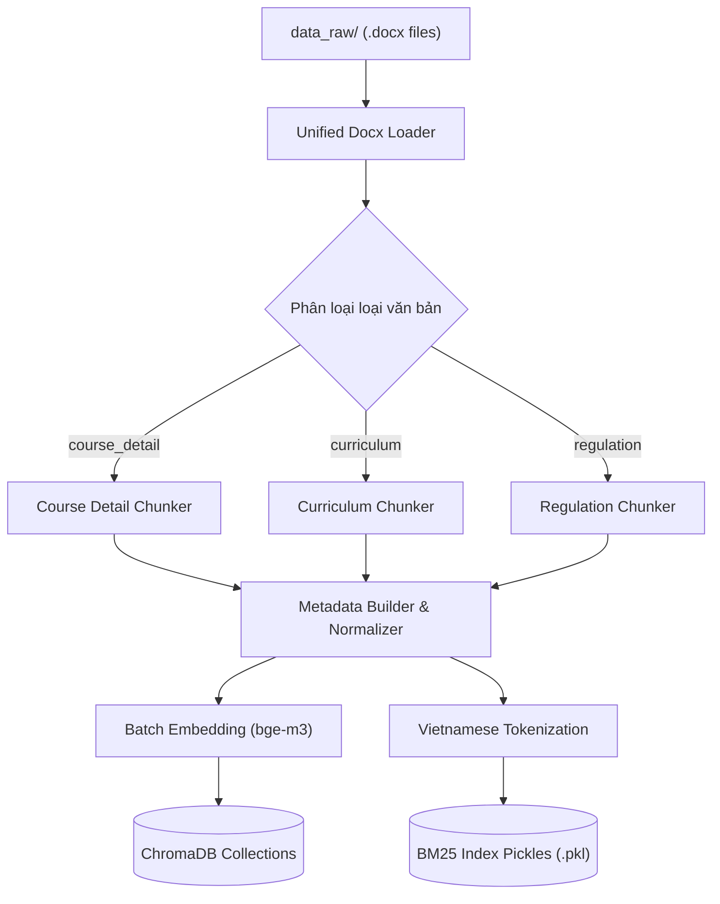
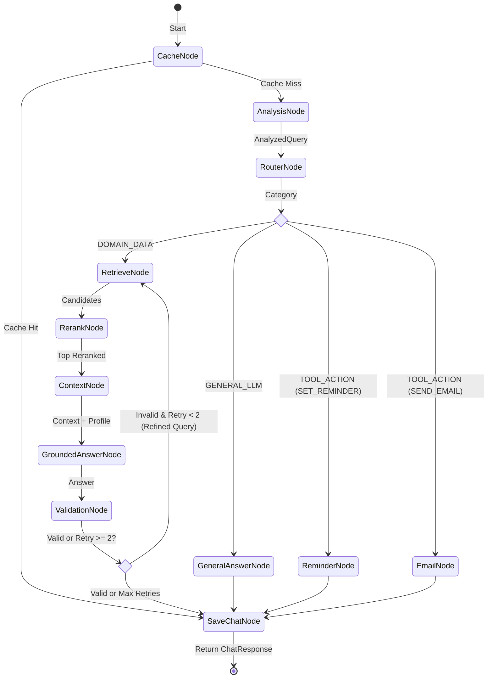
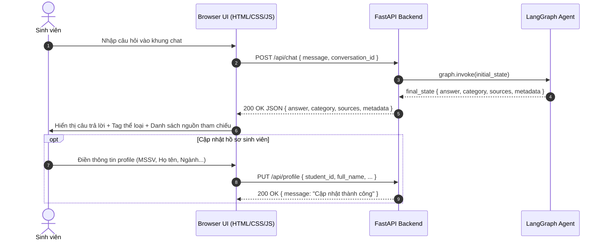

# KIẾN TRÚC HỆ THỐNG AI ACADEMIC ADVISOR

> **Hệ thống Trợ lý Cố vấn Học tập Thông minh (Agentic RAG)**  
> Khoa Công nghệ Thông tin - Trường Đại học Đại Nam  
> Trạng thái hiện tại: **READY_FOR_FINAL_ACCEPTANCE** (Hướng tới Level 4)

---

## 1. Tổng quan Kiến trúc (System Overview)

Dự án được tái cấu trúc thành một sản phẩm chạy local trọn vẹn, không phụ thuộc Docker, không sử dụng Streamlit, tuân thủ nguyên tắc mô-đun hóa cao và decoupling rõ ràng giữa Frontend (HTML5/CSS3/Vanilla JS) và Backend (FastAPI + LangGraph + ChromaDB + BM25).

---

## 2. Luồng Xử lý Dữ liệu Ingestion (Ingestion Pipeline)

Toàn bộ tài liệu học vụ raw (`.docx`) được nạp và phân mảnh có ngữ cảnh:
1. **Loaders**: Duy trì thứ tự giữa các đoạn văn và bảng biểu (`table_row_idx`).
2. **Chunkers**: Nhận diện cấu trúc header, bảng, học phần, chuẩn đầu ra (CLO), kế hoạch giảng dạy theo tuần.
3. **Metadata Builder**: Chuẩn hóa schema metadata (`course_code`, `document_type`, `section`, `subsection`, `chunk_id`) với kiểu dữ liệu primitive an toàn cho ChromaDB.
4. **Multi-collection Vector Store & BM25**: Tách thành 3 collection (`course_detail`, `curriculum`, `regulation`) và lưu đồng thời chỉ mục BM25 Okapi tương ứng.

---

## 3. Đồ thị Trạng thái LangGraph (Agent State Graph)

Workflow đồ thị được xây dựng trên `langgraph.graph.StateGraph` với **100% các node đều có đường vào và ra**, loại bỏ hoàn toàn dead node.

---

## 4. Chi tiết các Thành phần Hệ thống

### 4.1. Central Configuration (`src/config/settings.py`)
- Quản lý toàn bộ cấu hình hệ thống bằng `pydantic`/`dataclass`/`os.getenv`.
- Tự động nạp `.env` từ thư mục gốc, có giá trị mặc định an toàn cho tất cả các tham số.
- Đảm bảo các thư mục runtime tồn tại (`settings.ensure_directories()`).

### 4.2. Provider-Neutral LLM Gateway (`src/llm/client.py`)
- Hỗ trợ bất kỳ endpoint nào tương thích chuẩn OpenAI (`OpenAI`, `Groq`, `vLLM`, `Ollama`, `DeepSeek`).
- Quản lý timeout, retry logic (exponential backoff), graceful fallback.
- Hỗ trợ cơ chế `set_mock_llm_handler()` phục vụ chạy kiểm thử tự động trong môi trường CI/Offline không cần API key và không tốn chi phí.

### 4.3. Query Analyzer & Conversational Resolution (`src/rag/query_analyzer.py`)
- Bóc tách mã môn (`FIT\d{4}`), khóa học (`K\d{1,2}`), ngành học và các targets học vụ (`credits`, `lecturer`, `clo`, `course_plan`, `assessment`).
- Giải quyết đại từ thay thế tiếng Việt (*"môn đó"*, *"môn này"*, *"học phần đấy"*) dựa trên thực thể xuất hiện trong lịch sử hội thoại gần nhất.

### 4.4. Hybrid Retrieval & Reciprocal Rank Fusion (`src/rag/hybrid_retriever.py`)
- Kết hợp tìm kiếm ngữ nghĩa Dense (Cosine similarity từ BAAI/bge-m3) và tìm kiếm từ khóa BM25 Okapi.
- Thuật toán RRF chuẩn:
  $$RRF(d) = \sum_{m \in \{dense, bm25\}} \frac{1}{k + rank_m(d)} \quad (k = 60)$$
- Hỗ trợ metadata filtering chính xác (`course_code`) khi người dùng hỏi về môn học cụ thể.

### 4.5. Reranker & Fallback (`src/rag/reranker.py`)
- Sử dụng Cross-Encoder `ms-marco-MiniLM-L-6-v2` để chấm điểm tương quan sâu giữa query và candidate chunks.
- Cơ chế Fallback an toàn: Nếu môi trường tắt reranker (`ENABLE_RERANKER=false`) hoặc tải mô hình thất bại, hệ thống tự động giữ nguyên thứ tự tối ưu từ RRF.

### 4.6. Target-Aware Context Builder (`src/rag/context_builder.py`)
- Tự động tăng trọng số (boost) cho các đoạn tài liệu chứa section khớp với target của người dùng (`GIẢNG VIÊN`, `MỤC TIÊU`, `CHUẨN ĐẦU RA`, `KẾ HOẠCH THEO TUẦN`).
- Khử trùng lặp nội dung tương tự (text similarity > 0.85).
- Kiểm soát budget độ dài context và định dạng trích dẫn nguồn chuẩn xác (`[Nguồn: file | Phần: section | Học phần: course]`).

### 4.7. Grounded Answer & Chống Hallucination (`src/prompts/answer_prompt.py`)
- Chỉ cho phép LLM suy luận trên dữ liệu có trong context tham chiếu.
- Quy định cứng: Nếu không tìm thấy bằng chứng trong dữ liệu hiện có, LLM bắt buộc xuất câu từ chối chuẩn:
  > `"Chưa tìm thấy đủ dữ liệu trong tài liệu hiện có để trả lời chính xác."`

### 4.8. Exact Cache (`src/cache/exact_cache.py`)
- In-memory Singleton Cache dựa trên normalized query string.
- Giúp phản hồi tức thì (< 5ms) cho các câu hỏi trùng lặp mà không tốn chi phí gọi LLM/Retrieval.

### 4.9. Three-Tier Memory (`src/memory/`)
1. **StudentMemory**: Lưu hồ sơ sinh viên (MSSV, họ tên, lớp, ngành, GPA) dưới dạng `runtime/student_profile.json`.
2. **ChatMemory**: Lưu lịch sử chat multi-turn theo phiên làm việc dưới dạng `runtime/chat_history.json`.
3. **VectorMemory**: Hỗ trợ lưu trữ semantic memory dài hạn cho sinh viên.

### 4.10. Tool Actions (Reminder & Email)
- **APScheduler**: Quản lý lịch nhắc nhở học tập (ôn thi, nộp bài), được điều khiển qua FastAPI lifespan events.
- **EmailSender**: Hỗ trợ gửi email thông báo qua SMTP, có cơ chế an toàn báo trạng thái mô phỏng khi chưa bật cấu hình `EMAIL_ENABLED=false`.

---

## 5. Kiến trúc Giao tiếp Frontend - Backend

---

## 6. Bảo mật & Quy chuẩn Triển khai
- Không chứa bất kỳ hardcoded credentials hay secrets nào trong repository.
- File `.gitignore` bảo vệ tuyệt đối file `.env`, thư mục `runtime/`, `vector_store/`, và các file nhị phân.
- Chạy 100% bằng virtual environment thuần túy của Python (không Docker, không container overhead).
