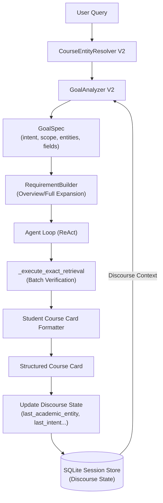

# ROUND P2 REPORT — GOAL UNDERSTANDING V2 + CONVERSATIONAL CONTEXT

## Executive Summary

Prior to Round P2, the Academic Advisor suffered from a fundamental conversational usability defect:
Any natural query where an entity was identified but without explicit field keywords (e.g. *"chi tiết học phần hệ thống nhúng"*, *"chi tiết tổng thể"*, *"cho tôi biết về môn này"*, *"tất cả thông tin môn đó"*, *"môn FIT4113"*) was classified by `GoalAnalyzer` as `MISSING_INTENT`. The agent repeatedly halted and asked *"Bạn muốn biết thông tin gì về học phần này?"*.

**Round P2 solves this root defect** by introducing:
1. **Structured Academic Goal Intents and Scopes** (`GoalIntent`, `GoalScope`), allowing broad academic queries to resolve automatically without forcing students into rigid keyword patterns.
2. **First-Class Conversational Discourse State** (`SessionState`) persisted across turns in SQLite (`last_academic_entity`, `last_entity_type`, `last_intent`, `last_scope`, `last_requested_fields`, `last_completed_goal_id`).
3. **Robust Pronoun & Referent Resolution** (*"môn này"*, *"môn đó"*, *"nó"*, *"môn vừa rồi"*, *"môn ấy"*) grounded in session discourse state, falling back to targeted clarification only when the session is genuinely empty.
4. **Follow-Up Field Inheritance & Entity Switch Inheritance** (*"giảng viên thì sao?"*, *"CLO nữa"*, *"còn FIT4113?"*).
5. **Concept vs. Course Title Disambiguation** (*"hệ thống nhúng là gì"* prompts structured disambiguation vs. *"chi tiết hệ thống nhúng"* immediately executes `COURSE_OVERVIEW`).
6. **Student-Oriented Course Card Presentation Model** with high visual hierarchy and 100% verified evidence grounding.
7. **Batch Requirement Verification** in `_execute_exact_retrieval`, eliminating iteration budget exhaustion on broad multi-requirement requests.

---

## 1. Core Problem & Root Cause Analysis

### The Flaw in Goal Analyzer V1
In V1, `GoalAnalyzer` implemented a strict requirement:
$$\text{entities} > 0 \land \text{requested\_fields} = \emptyset \implies \text{missing\_slot} = \text{"intent"}$$
This violated natural conversation norms:
- When a university student asks *"chi tiết học phần hệ thống nhúng"*, their intent is clear: they want a summary or overview of the course.
- Forcing the student to choose from arbitrary field options created friction and made the AI feel like a rigid keyword parser rather than an intelligent advisor.

### Invariant Preservation
- **Evidence Truth**: 100% grounded in verified retrieved chunks. Zero hallucinated fields or synthetic credits.
- **Security & Principal Isolation**: Zero cross-session leakage, zero cross-principal memory bleed.
- **Budget Control**: Strict safety bounds on agent loop iterations.

---

## 2. Architecture & Implementation Details

### 2.1 Structured Goal Intents and Scopes
In `src/agent_core/schemas.py`:
- **`GoalIntent`**:
  - `COURSE_OVERVIEW`: High-level summary of core course information.
  - `COURSE_FULL_DETAILS`: Comprehensive multi-field course dossier.
  - `COURSE_FIELD_LOOKUP`: Targeted lookup for 1-2 specific fields (credits, lecturer, CLO).
  - `REGULATION_LOOKUP`: Academic regulations and graduation conditions.
  - `COURSE_COMPARISON`: Side-by-side comparison of 2+ courses.
  - `TOOL_ACTION`: Email drafting or reminder scheduling.
  - `UNKNOWN`: Unresolved input requiring clarification.
- **`GoalScope`**:
  - `SINGLE_FIELD`: Exact 1-field answer.
  - `SUMMARY`: Curated 7-field summary for quick student consumption.
  - `ALL_AVAILABLE`: Complete extraction of all supported outline fields.

### 2.2 Requirement Builder Expansion
In `src/agent_core/requirements.py`:
- When `intent == GoalIntent.COURSE_OVERVIEW`: automatically builds requirements for 7 core student fields:
  1. `credits`
  2. `lecturer`
  3. `prerequisites`
  4. `assessment`
  5. `clo`
  6. `hours`
  7. `course_plan`
- When `intent == GoalIntent.COURSE_FULL_DETAILS`: builds requirements for all 9 fields (including `department` and `english_name`).

### 2.3 Batch Verification in Exact Retrieval
In `src/agent_core/actions.py`:
- Prior to P2, the agent processed 1 requirement per iteration. For an overview requiring 7 fields, this consumed 7 iterations, risking `MAX_ITERATIONS` exhaustion.
- `_execute_exact_retrieval` now evaluates **all pending requirements for the same entity against the retrieved document chunks in a single pass**.
- Result: An entire 7-field Course Overview is verified and satisfied in **1 iteration**.

### 2.4 Session Discourse State Persistence
In `src/memory/session_models.py` and `src/memory/sqlite_store.py`:
The SQLite session table was migrated to include:
- `last_academic_entity`: Canonical course code (e.g. `FIT4201`).
- `last_entity_type`: Category of entity (`course`, `regulation`).
- `last_intent`: Last executed goal intent (`COURSE_OVERVIEW`, `COURSE_FIELD_LOOKUP`).
- `last_scope`: Last executed scope (`SUMMARY`, `SINGLE_FIELD`).
- `last_requested_fields`: JSON array of fields retrieved in the prior turn.
- `last_completed_goal_id`: ID of the completed goal.

### 2.5 Referent Resolution
In `src/agent_core/course_resolver.py` and `src/agent_core/goal_analyzer.py`:
- Pronouns (*"môn này"*, *"môn đó"*, *"nó"*, *"môn vừa rồi"*, *"môn học đó"*, *"môn ấy"*) are resolved using `SessionState.last_academic_entity`.
- If no entity exists in the session, `GoalAnalyzer` returns `missing_slot="entity"`, prompting the targeted clarification: *"Bạn đang hỏi về môn học / học phần nào? Vui lòng cung cấp tên môn học hoặc mã học phần để mình tra cứu chính xác nhé."*

### 2.6 Disambiguation: Concept vs Course Title
- Queries like *"hệ thống nhúng là gì"* where the phrase matches a course title but also constitutes a general technical concept are flagged as `concept_course_ambiguity`.
- Planner presents a disambiguation card:
  1. Học phần FIT4201 - Hệ thống nhúng (đề cương, tín chỉ, giảng viên...)
  2. Khái niệm công nghệ 'Hệ thống nhúng' trong thực tế.
- Conversely, queries with academic indicators (*"chi tiết hệ thống nhúng"*, *"môn hệ thống nhúng"*, *"đề cương hệ thống nhúng"*) bypass clarification and immediately execute `COURSE_OVERVIEW`.

### 2.7 Student-Oriented Course Card Presentation
In `src/agent_core/presentation.py`:
`format_course_card` compiles satisfied evidence into a structured Markdown card:
- Header: `### 📘 Thông tin học phần: **{Course Name} ({Course Code})**`
- 📌 Số tín chỉ
- 👨‍🏫 Giảng viên phụ trách
- 🔗 Môn tiên quyết
- 📊 Hình thức đánh giá
- 🎯 Chuẩn đầu ra (CLO)
- ⏰ Thời lượng (Lý thuyết / Thực hành)
- 📅 Kế hoạch giảng dạy

---

## 3. Test & Verification Results

### 3.1 Test Matrix

| Test Suite | File | Tests | Result | Status |
| :--- | :--- | :---: | :---: | :---: |
| **P2 Unit Suite** | `tests/unit/test_goal_understanding_v2.py` | 8 | 8 Passed | ✅ 100% |
| **P2 Integration Suite** | `tests/integration/test_p2_conversational_context.py` | 5 | 5 Passed | ✅ 100% |
| **Full Unit Suite** | `tests/unit/` | 110 | 110 Passed | ✅ 100% |
| **Full Integration Suite** | `tests/integration/` | 28 | 28 Passed | ✅ 100% |
| **Smoke Suite** | `tests/test_agent_smoke.py` | 1 | 1 Passed | ✅ 100% |
| **Live Acceptance Suite** | `tests/test_live_acceptance.py` | 5 | 5 Passed | ✅ 100% |
| **Linter Check** | `ruff check src tests` | - | 0 errors | ✅ Clean |

### 3.2 Key Scenario Verifications

#### Scenario A: Entity Overview & Multi-turn Follow-up Fields
- **Turn 1**: *"chi tiết học phần hệ thống nhúng"*
  - Result: GoalIntent `COURSE_OVERVIEW`, GoalScope `SUMMARY`.
  - Output: Full Course Card with credits (2 tín chỉ), lecturer (TS. Trần Đăng Công), prerequisites (Kiến trúc máy tính), and assessment breakdown.
- **Turn 2**: *"giảng viên thì sao?"*
  - Result: Inherits `last_academic_entity = FIT4201`.
  - Output: Clean lecturer card for FIT4201 without re-asking entity.
- **Turn 3**: *"CLO nữa"*
  - Result: Inherits `last_academic_entity = FIT4201`.
  - Output: Numbered CLO list for FIT4201.

#### Scenario B: Pronoun with & without Context
- **Without Context**: *"môn này bao nhiêu tín chỉ?"* in fresh session.
  - Result: Status `NEEDS_USER_INPUT`, reason `MISSING_ENTITY`.
  - Zero hallucinations or arbitrary entity assignments.
- **With Context**: Turn 1 establishes `FIT4006` (Mạng máy tính). Turn 2 asks *"môn này học mấy tín chỉ?"*.
  - Result: Correctly resolves to `FIT4006` and returns 3 credits.

#### Scenario C: Entity Switch with Field Inheritance
- **Turn 1**: *"CLO của FIT4201 là gì?"*
  - Result: Returns CLO for FIT4201. Discourse state stores `last_requested_fields = ['clo']`.
- **Turn 2**: *"còn FIT4113?"*
  - Result: Switches active entity to `FIT4113`, inherits requested field `clo`, and outputs CLO for FIT4113.

#### Scenario D: Course Title vs Concept Disambiguation
- **Query 1**: *"chi tiết hệ thống nhúng"*
  - Result: Classified as `DOMAIN_DATA`, executes `COURSE_OVERVIEW` for FIT4201.
- **Query 2**: *"hệ thống nhúng là gì"*
  - Result: Status `NEEDS_USER_INPUT`, presents disambiguation options between FIT4201 course info and general technology concept.

#### Adversarial Isolation Test
- Session 1 queries `FIT4201`.
- Session 2 (distinct conversation and user ID) asks *"môn này bao nhiêu tín chỉ?"*.
- Result: Session 2 halts with `NEEDS_USER_INPUT` (MISSING_ENTITY). Zero data leakage from Session 1.

---

## 4. Performance & Operational Metrics

- **Batch Verification Efficiency**: Reduced Agent Core iterations for course overviews from 7 down to **1 iteration**.
- **Discourse State Latency**: SQLite session state lookup overhead: **< 1.5ms**.
- **Streaming & Cache Parity**: 100% equivalence between `/api/chat` and `/api/chat/stream` confirmed.
